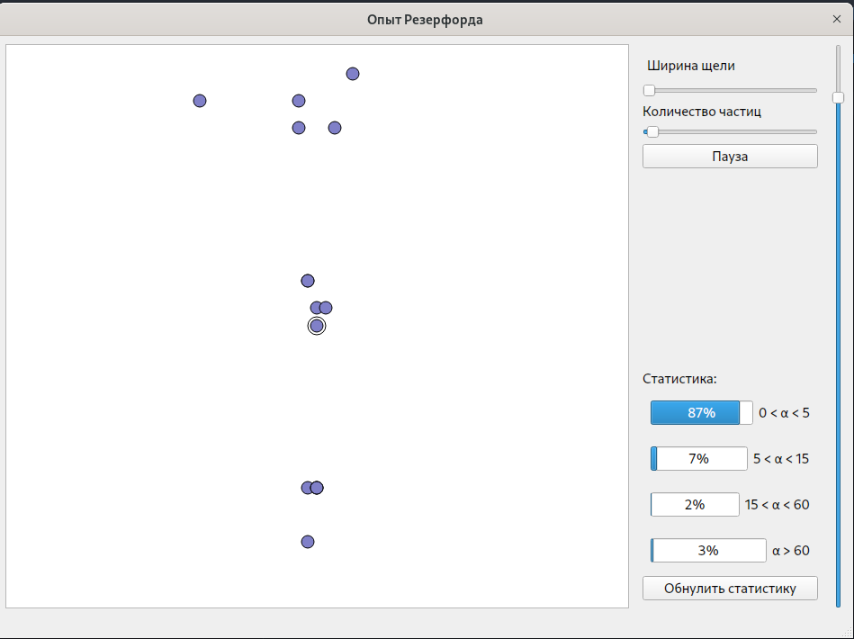

# Симуляция опыта резерфорда по рассеянию альфа-частиц

Симулирует поток частиц, напраленный на атом золота.

Показывает статистику угла рассеяния альфа-частиц




## Сборка
Зависимости:
- Qt6
```bash
cmake CMakeLists.txt -B ./build
make -C ./build
```
## Запуск
```bash
./build/au
```

## PS

Этот репозиторий - решение [13 задачи](http://phys.nsu.ru/fit/%D0%97%D0%B0%D0%B4%D0%B0%D0%BD%D0%B8%D0%B5%20%D0%A4%D0%98%D0%A2%2021%D0%B3.pdf) 